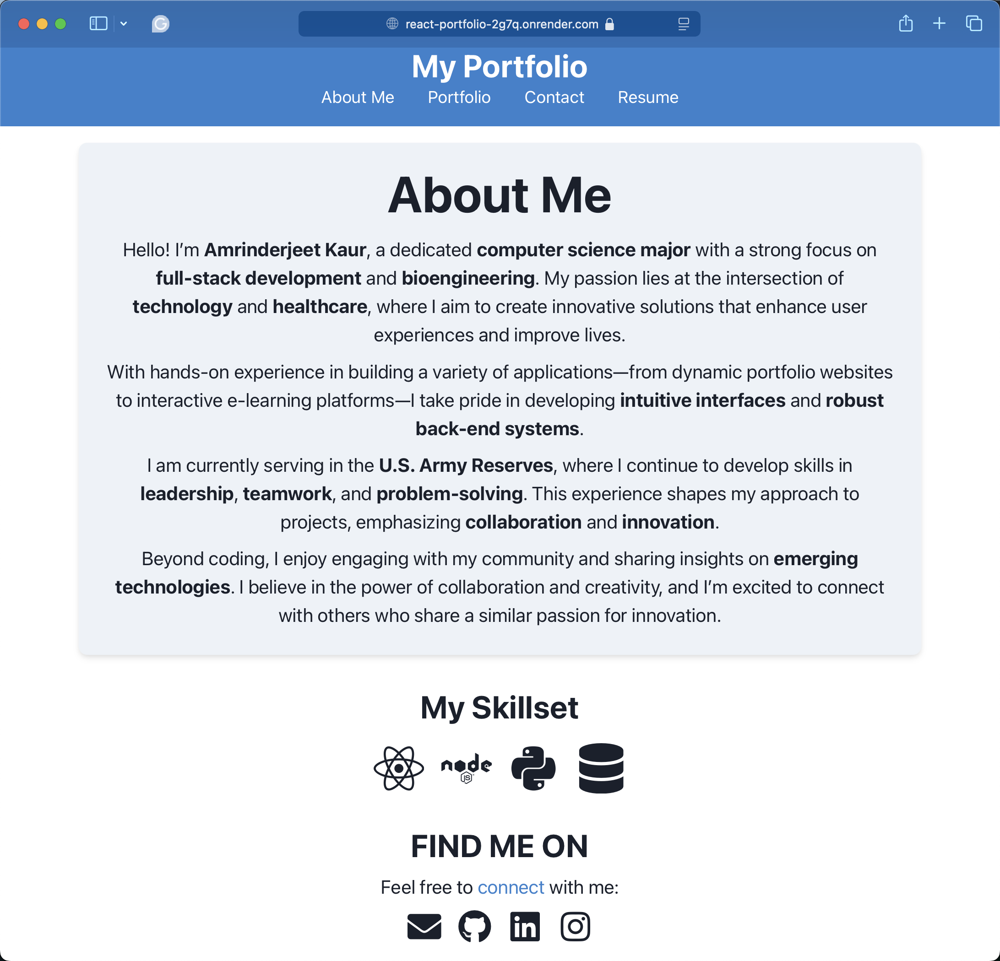
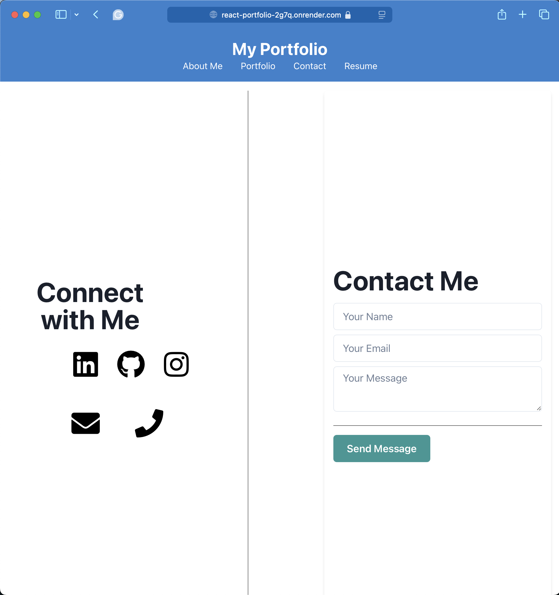
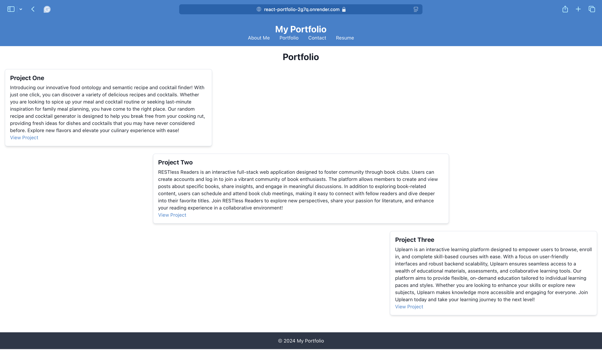

# React Challenge: React Portfolio

## Description

This project showcases a portfolio built using React, designed to help developers stand out by leveraging modern web technologies. The portfolio includes sections for About Me, Projects, Contact, and Resume, allowing potential employers to assess the developer's skills and experience.

## User Story

- AS AN employer looking for candidates with experience building single-page applications
- I WANT to view a potential employee's deployed React portfolio of work samples
- SO THAT I can assess whether they're a good candidate for an open position

## Getting Started

### Technologies Used

- React
- Vite
- HTML/CSS

### Project Structure

- **Header Component**: Displays the developer's name and navigation.
- **Navigation Component**: Renders different sections.
- **Project Component**: Used multiple times in the Portfolio section.
- **Footer Component**: Appears on multiple pages.

## Projects

### Featured Projects

1. **About Me**
   - 
   - [Deployed Application](https://react-portfolio-2g7q.onrender.com)
   - [GitHub Repository](https://github.com/AJKaur02/Challenge-20-React-Portfolio)

2. **Contact Me**
   - 
   - [Deployed Application](https://react-portfolio-2g7q.onrender.com)
   - [GitHub Repository](https://github.com/AJKaur02/Challenge-20-React-Portfolio)

3. **Projects**
   - 
   - [Deployed Application](https://react-portfolio-2g7q.onrender.com)
   - [GitHub Repository](https://github.com/AJKaur02/Challenge-20-React-Portfolio)

## Installation

1. Clone the repository:
   ```bash
   git clone https://github.com/AJKaur02/Challenge-20-React-Portfolio
   ```
2. Navigate to the project directory:
   ```bash
   cd repository
   ```
3. Install dependencies:
   ```bash
   npm install
   ```
4. Run the application:
   ```bash
   npm run dev
   ```

## Deployment

This application is deployed on Render. You can view it live [here](hhttps://react-portfolio-2g7q.onrender.com).

## License

This project is licensed under the MIT License - see the [LICENSE](LICENSE) file for details.